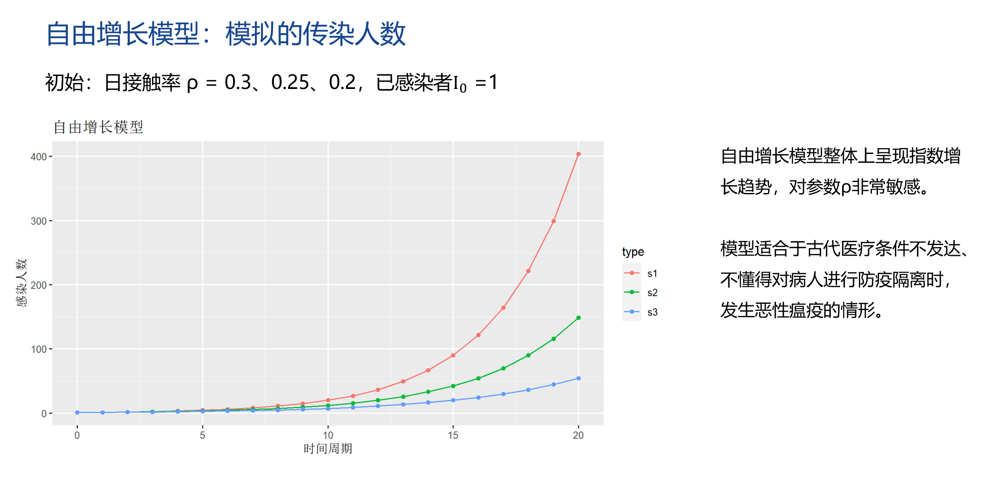
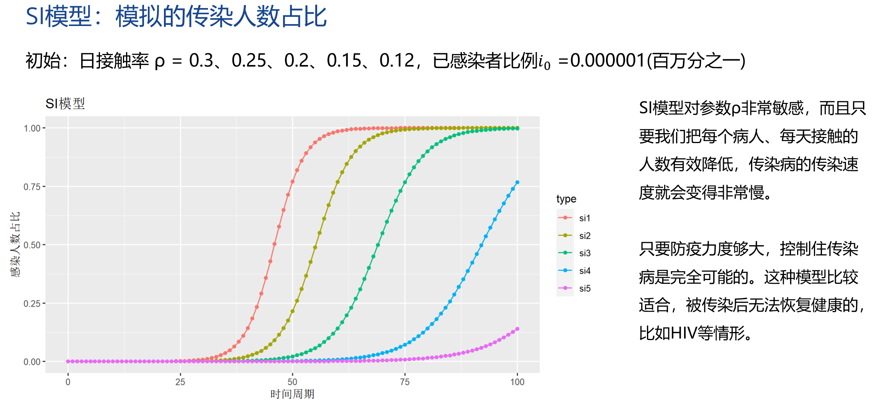
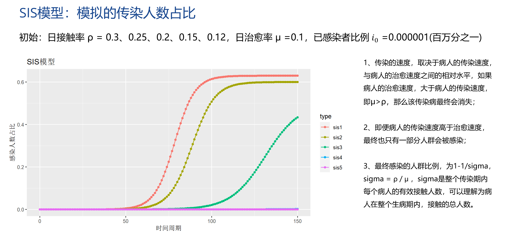
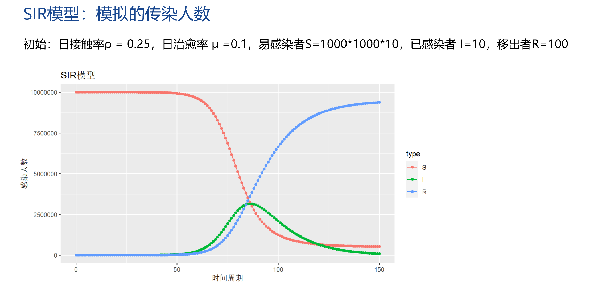
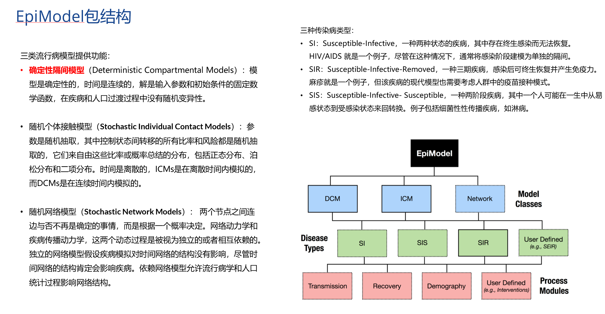
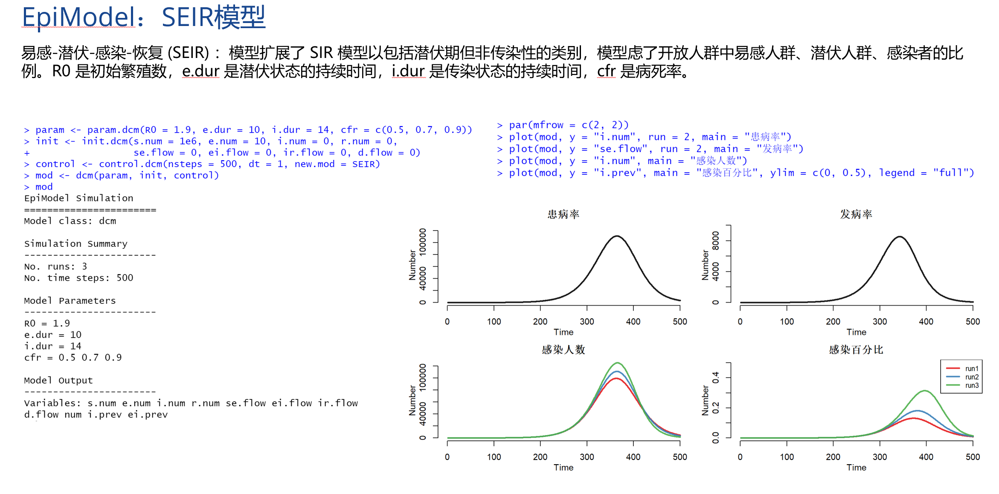
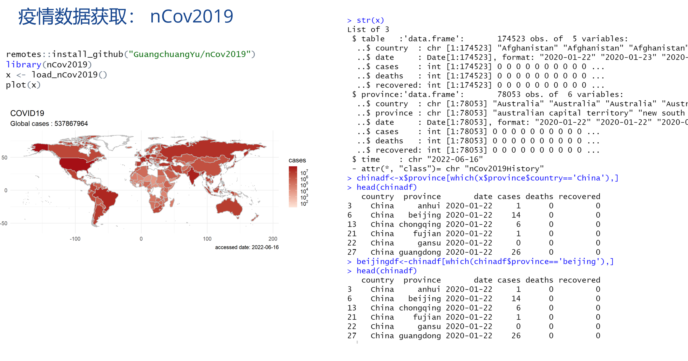

# 用R语言解读传染病传播模型

新冠疫情几次变异，极大地影响着我们的正常生活和工作。特别是2022年2月以来的Delta变异株感染，在上海和北京这种人口超大型城市中，有着超强的传染力。政府防疫工作的强力介入，隔离和居家已经是常态了，有新闻指出Delta变异株感染1人可传9人。

在流行病学领域，有几种不同传染病的传播模型，可以模拟病毒的传播过程。本次分享将使用R语言，来给大家演示病毒传播的过程。了解了病毒传播的逻辑，能让我们更加坚定战胜病毒的决心。

## 目录

+ 传染病模型原理：自由增长模型、SI模型、SIS模型、SIR模型
+ 用R语言手动实现
+ 基于EpiModel包的自动化实现
+ 如何获取新冠数据
+ 北京的数据带入模型预测

## 代码code

+ model.r，按数学公式，手动编写模型代码，并进行传播模拟。
+ model-epi.r，使用EpiModel包，进行传播模拟。
+ beijing.r，获取全球疫情数据，抽取北京的数据，进行疫情的预测。

## PPT展示

自由增长模型

SI模型

SIS模型

SIR模型

EpiModel包

SEIR模型

疫情数据获取

