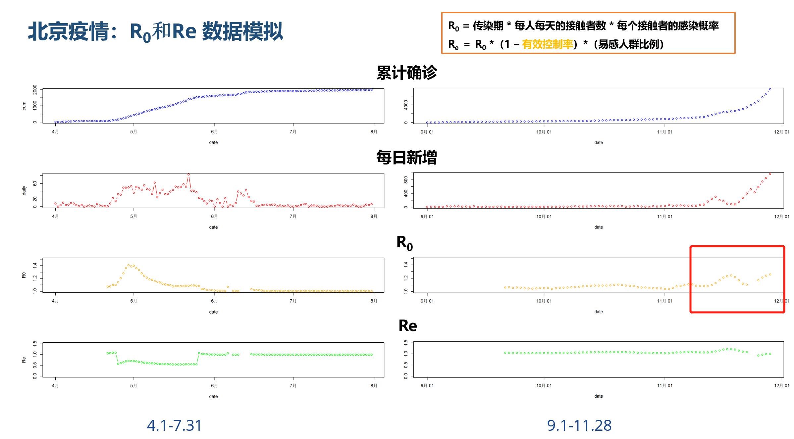
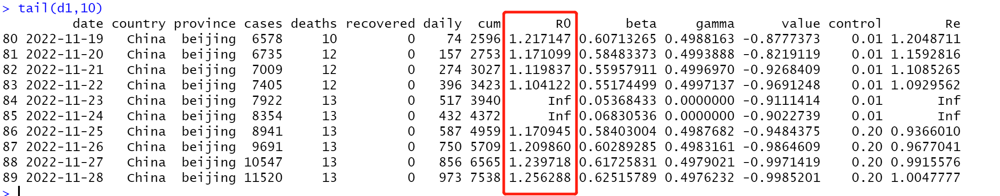
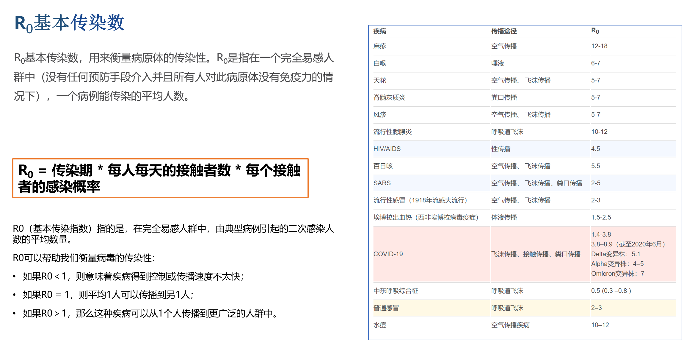
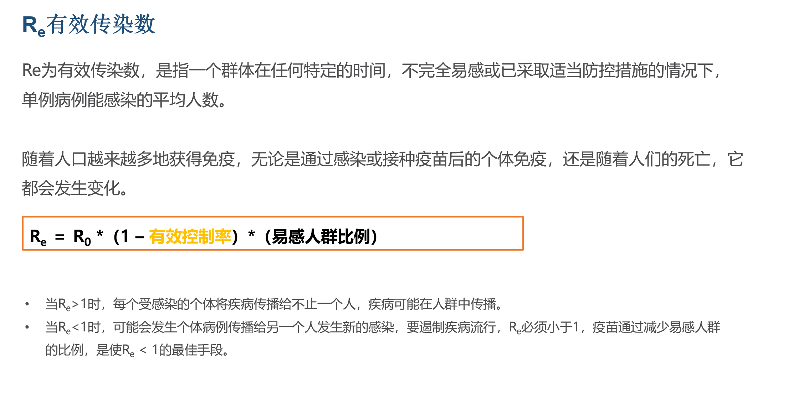

# 用R语言解读传染病传播模型

<https://github.com/bsspirit/infect/blob/main/北京模型结果-20221129.md>

居家办公，做了个疫情模型，设7天传染期，北京3000万人口，对比4月份，SIR模型拟合，管控有效率设为0.2。

北京疫情还在持续，模型结果R0数据值还在增加。R0=1.25表示为2022-11-28日，1个人还是能传染1.25个人。模型结果仅供参考。疫情走势不同于4月份，R0值快速增加快速回落，当前疫情还没有到达顶点。

模型的数据值，今天 R0=1.25，表达在2022-11-28日，1个人还是能传染1.25个人。

R0的解释：相比于维基百科的Omicron的R0=7的传染数，还是非常低的。

RE的解释

